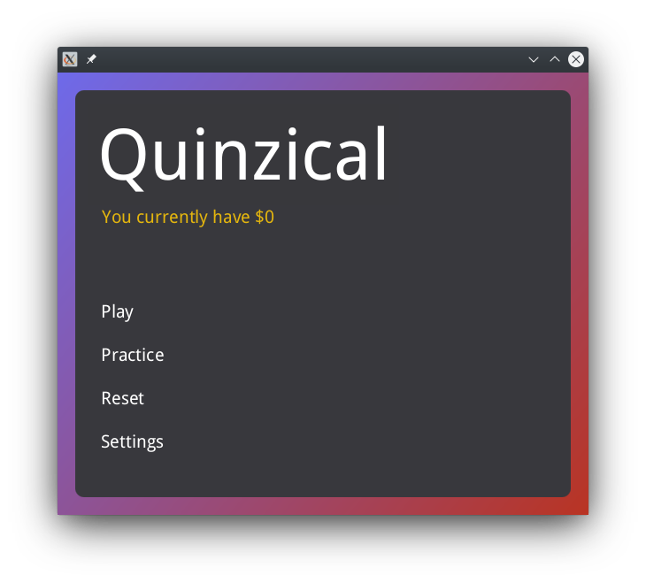
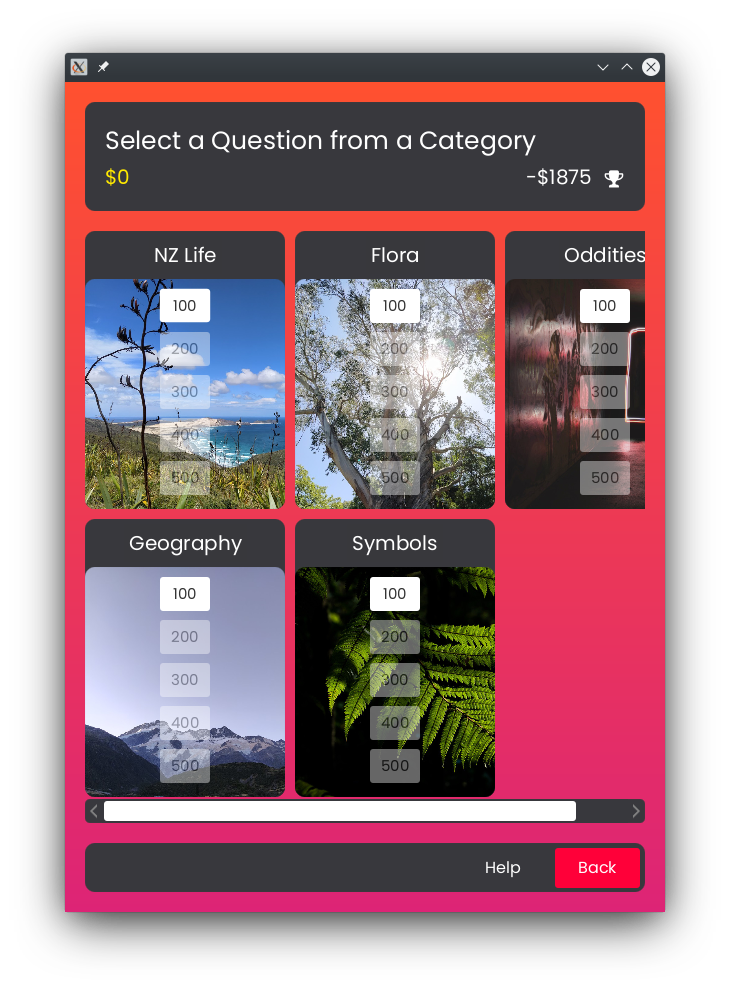
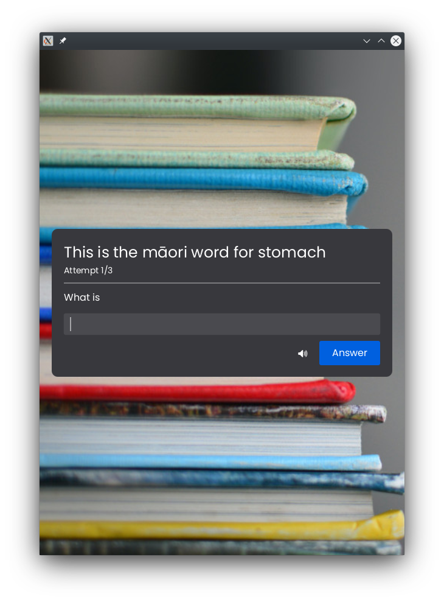

# Quinzical

Quinzical is a New Zealand focused quiz game written in Java
targeted towards Young Adults (18 - 25 year olds) who wish to improve their knowledge of New Zealand
by learning NZ trivia.

[Read the instructions here.](wiki/docs/README.md)

## Screenshots

