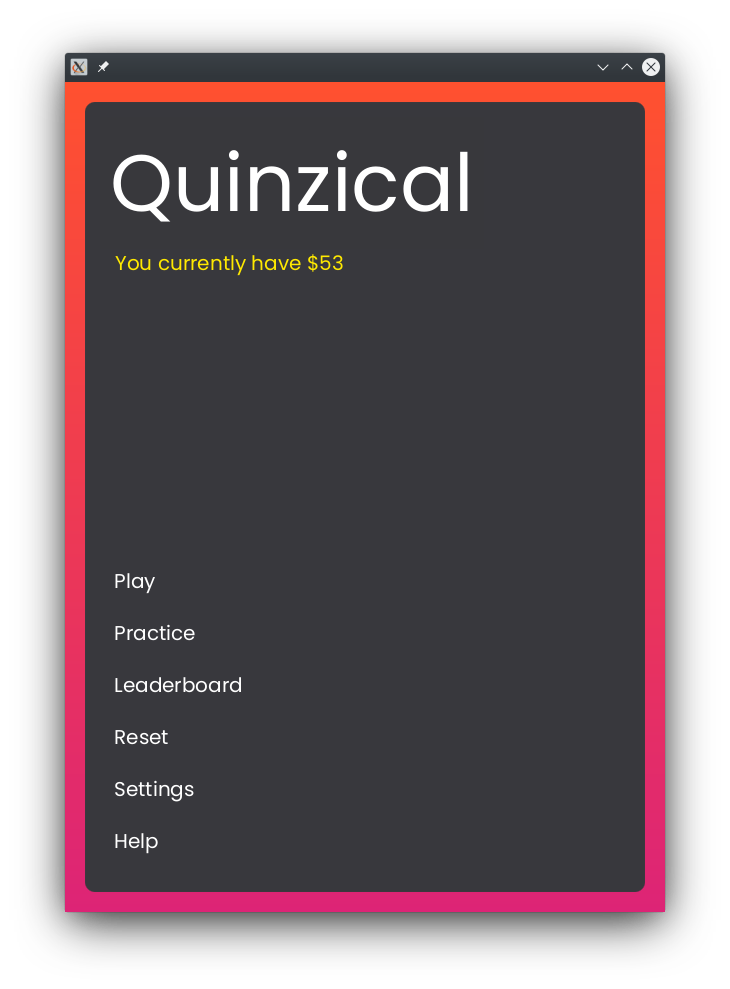
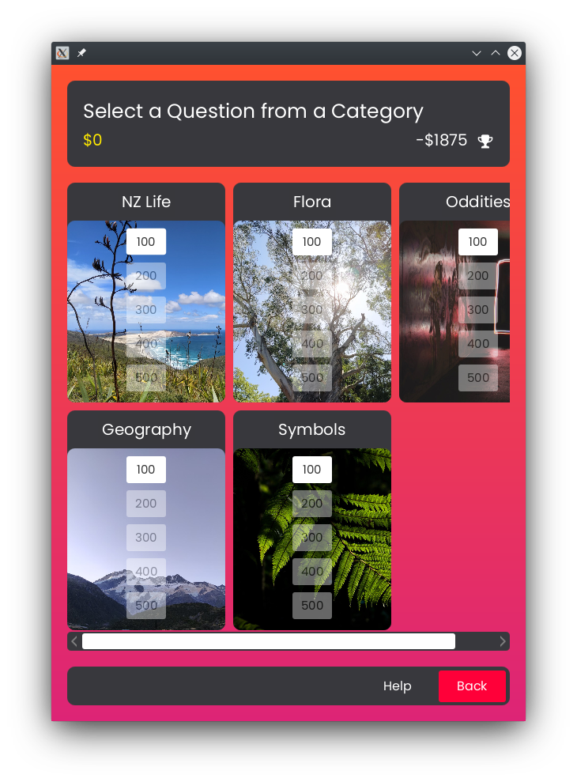

# Usage

## Start Screen

When you first open the game, you will be shown this screen.

At the top, you will notice some text in yellow which shows your current score. This value is how much you have won by answering questions in the main game mode.

There are four buttons below that:

- **Play**
Press this to start playing the main game.\
[See more about the main game.](#main-game)
- **Practice**
Press this to go the practice section of the game where you can hone your skills before trying out the main game.\
[See more about the practice mode.](#practice-mode)
- **Reset**
Press this to reset the current game.\
[See more about the reset page.](#reset)
- **Settings**
Press this to change the audio settings of the game.\
[See more about the settings page.](#settings)

## Main Game

You should be able to see a screen like the above with different "cards".

Each card represents a category (which has its name at the top of the card) from which you can select from and each button represents a question with their respective value.

- A button will be green and unclickable if you have already attempted the question it represents and have gotten that question correct.
- A button will be red and unclickable if you have already attempted the question it represents and have gotten that question incorrect.
- A button will be grey and unclickable if you have not yet attempted it but cannot attempt it yet because there's another question in the same category with a lower value that you must do first.
- A button will be white and clickable if you have not yet attempted it and it is the lowest value out of that category.

You can only attempt questions that have the lowest value in that category.

Click on a white button of your desired category to attempt that question. You should then be taken to this page.

Once this page is shown, you should hear a question being read out. If you didn't catch the question the first time, click on the audio button on the left with the `🔉` icon to hear it again.

When you are ready to answer the question, write it in the text box. Once you've written your answer, press the blue `Answer` button to submit it.

If you don't know the answer, click on the rightmost white `Don't Know` button,

After pressing either button, you should be taken to the result screen.

If you are correct you should be shown this screen:

The amount that it says you've earned will be added to your current score.
Press the blue `OK` button to go back to the question select screen.

If you are incorrect then you would be shown this screen;

The correct answer is displayed and you don't gain any points.
Press the blue `OK` button to go back to the question select screen.

Your game will be saved automatically whenever you close the window.

Once you've finished all the questions in the game, your game will end and you'll be sent to this screen.

The text in yellow shows your final score.

Clicking the `Main Menu` button will take you back to the start screen and your game will be automatically reset.

---

## Practice Mode

(This section assumes you've played at least a little bit of the [main game](#main-game)).

The practice mode should be used when you want to practice your skills before doing an actual game. Attempting questions in the practice mode will *not* affect your score so do as many as you'd like!

As you can see, there are no button!

In the practice mode, none of the questions have scores and can be repeated as much as you'd like so instead you'll be choosing the category (by clicking on it) and you'll randomly be given a question from it!

The question page looks very similar to what you would get on the main game. However, you are given three attempts at the question! You can see what attempt you are on by looking at the number below the question text.

If you can't get it in your first two times, you'll get a hint on your third attempt! The hint is the first letter of the word - so in this case, we know the answer starts with `J`.

---

## Reset

Maybe a game is not going the way you would hope and you would like to start over. The reset game will reset your whole game including the questions you've answered and your current score - so be careful!

Press the `Yes, I'm sure` button to confirm your decision to reset the game.

If you change your mind, press the `No, let's go back` button.

**Note:** A game reset will *not* reset your settings.

---

## Settings

The settings page is for if you'd like to change the playback speed of the voice.

Settings Screenshot

Maybe the voice says the question too fast and you'd like to make it slower. Move the slider to the left.

If you'd like the voice to be faster, then move the slider to the right.

The speed value will be how much the speed of the voice will be "multiplied" by.
So:

- `1x` = Normal Speed
- `2x` = Twice as Fast
- `0.5x` = Twice as Slow

If you preferred the original speed, press the `Reset` button to reset the speed back to its default value.

Once you've decided on a speed, press the `Save` button to save your current settings.