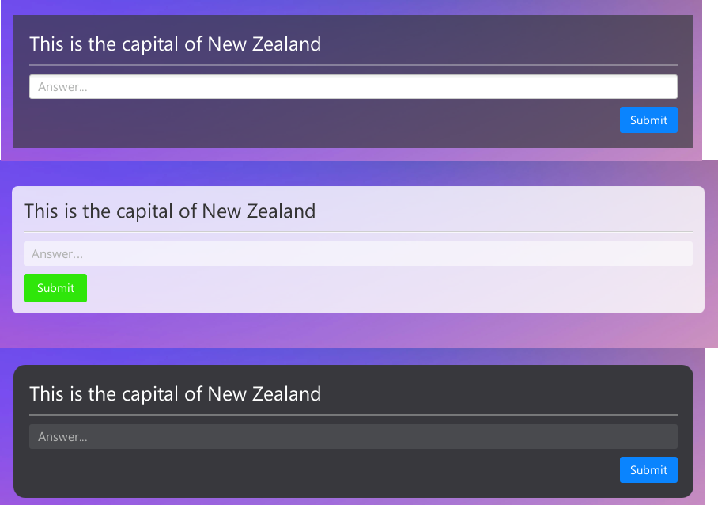

# Meeting Notes

The following are notes from our meetings.
They have been transcribed from our notion workspace.

---

## Meeting 1

**When**: Sep 11, 2020 3:00 PM-5:00 PM\
**Where**: Zoom

### What did we do?

- Introduced ourselves
- Looked over and discussed the specification PDF
- Asked Nasser for clarification
- Created the Team agreement:

    [SE206 Team Agreement Assignment Three.docx](https://drive.google.com/file/d/1iHnqkUxXZ5nwGrZt8v9a7rf-1rupNNpR/view?usp=drivesdk)
    
- Created the github repository
- Showed each other our implementations of assignment 2 and discussed certain implementation points like:
    - Using Scenebuilder and FXML for the GUI
    - Using JSON for the saving data format
- Decided to use Hiruna's assignment 2 implementation as a base for assignment 3

### What do we need to do?

- [x]  Hear back from Nasser about how much is expected by a "prototype"

---

## Meeting 2

**When**: Sep 14, 2020 3:00 PM-4:20 PM\
**Where**: Zoom

### Discuss

- [x]  Nasser's reply

### What did we do?

- Decide on what we want to have done by the end of the week
- Split the workload
- Put all tasks into a Kanban board

---

## Meeting 3

**When**: Sep 21, 2020 3:00 PM-4:00 PM\
**Where**: Zoom

Change the title to include the date.

### What happened last week?

- Finished the basic parts the main module
- Finished the practice modules

---

## Meeting 4

Created: Sep 28, 2020 3:35 PM
Created By: Hiruna Jayamanne
Last Edited Time: Oct 2, 2020 3:34 AM
When: Sep 28, 2020 3:00 PM-4:00 PM

### What did we do?

- Discuss the "Markdown Wiki"
- Discussed Mockups

Johnathan's Mockups

Hiruna's Mockup ([Figma Link](https://www.figma.com/proto/4wu1euWu51nUSHItEzbF06/Quinzical-Mockup?node-id=1%3A2&scaling=min-zoom))

- Decided on Johnathan's third mock up.

### What do we need to do

- Meet up at 3pm Thursday
